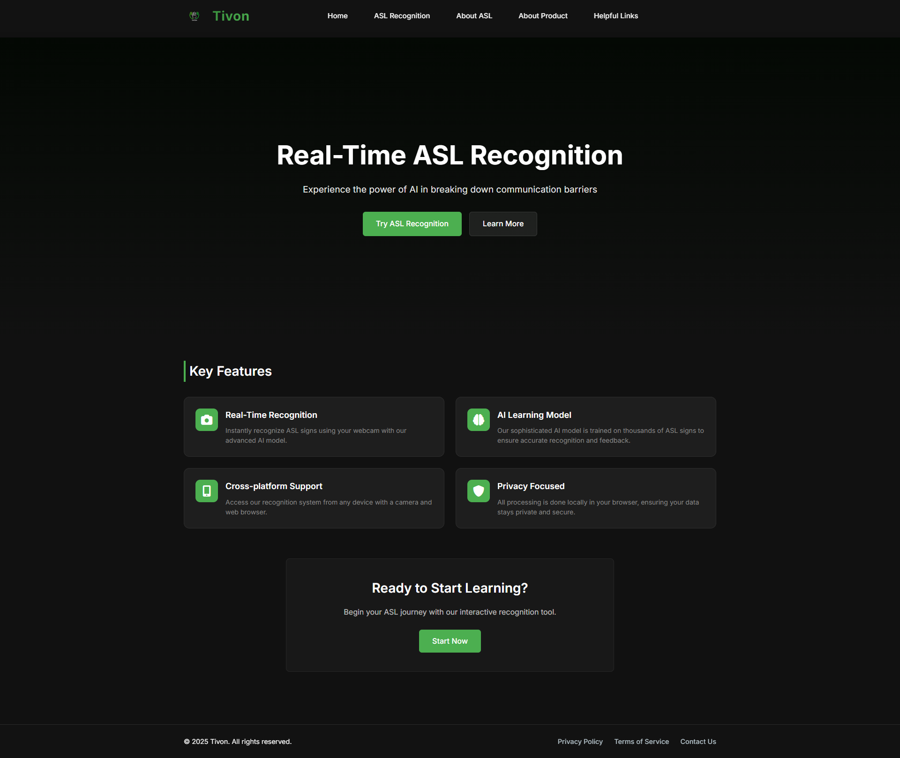

# Tivon – Real-Time ASL Recognition Web App

Tivon is a **real-time American Sign Language (ASL) recognition platform** that helps users learn and practice ASL using just a webcam. Powered by **deep learning** and **computer vision**, Tivon runs entirely in your browser with a focus on **privacy, accessibility, and user engagement**.

---

## ✨ Key Features

* **Real-Time Recognition:** Detect ASL signs instantly via webcam
* **Interactive Learning:** Explore the ASL alphabet with visual guides
* **Practice Tools:** Exercises and quizzes to improve signing skills
* **Progress Tracking:** Analytics to monitor your learning journey
* **Responsive Design:** Works on desktop, tablet, and mobile
* **Privacy First:** All processing happens locally; no data leaves your device

## ℹ️ Why “Tivon”?

Pronunciation: “Tih-von”

Breakdown: Combines “talk” (ti) and “vocal” (von), symbolizing communication through signs

Why it fits: Simple, friendly, and approachable with a modern tech vibe

Uniqueness: “Tivon” is an invented word with no existing online footprint in this context

---

## 🖼 Screenshots Carousel

<details>
<summary><strong>Home Screen</strong></summary>

</details>

<details>
<summary><strong>Recognition Screen</strong></summary>

</details>

<details>
<summary><strong>About ASL</strong></summary>

</details>

<details>
<summary><strong>About Product</strong></summary>

</details>

<details>
<summary><strong>Helpful Links</strong></summary>

</details>

> Click each section to expand the screenshot. This simulates a carousel in GitHub README.

---

## ⚙️ How It Works

Tivon combines:

* **MediaPipe:** For accurate hand tracking
* **Custom Deep Learning Model:** To classify ASL signs
* **Flask Backend & WebSockets:** For real-time communication
* **Frontend:** Interactive HTML, CSS, and JavaScript interface
  
⚠️ Note: The ASL model is not included in this repository. You will need to provide your own trained model. All recognition is performed locally to ensure maximum privacy.

---

## 🛠 Technologies

* **Frontend:** HTML5, CSS3, JavaScript, Bootstrap
* **Backend:** Python, Flask, OpenCV, MediaPipe
* **Machine Learning:** TensorFlow, Keras
* **Database:** SQLite

---

## 🚀 Getting Started

### Prerequisites

* Python 3.8+
* Webcam
* Modern browser with JavaScript enabled

### Installation

```bash
git clone https://github.com/yourusername/tivon.git
cd tivon
python3 -m venv venv
source venv/bin/activate  # Windows: venv\Scripts\activate
pip install -r requirements.txt
```

Place your trained ASL model in the `aslsavedmodelfinetunedv3/` folder.

### Running the App

```bash
python app.py
```

Open [http://localhost:5000](http://localhost:5000) in your browser.

---

## 🤝 Contributing

Contributions are welcome! See `CONTRIBUTING.md` for guidelines.

---

## 📄 License

This project is licensed under the **MIT License** – see `LICENSE` for details.

---

## 📬 Contact

Created by **[Khan Rehan]** – reach out with questions or suggestions!

---


